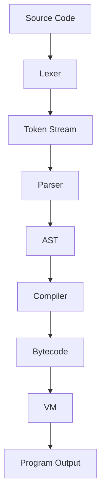
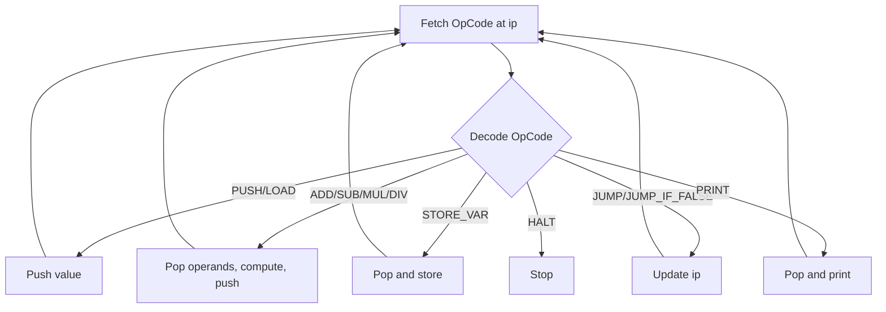

# CVM++

CVM++ is a compact, educational language implementation in C++ with a full pipeline:
Lexer -> Parser -> AST -> Bytecode Compiler -> Stack-based VM.

## Project Goals
- Keep the core language/runtime simple and inspectable.
- Make each compiler phase explicit for learning and debugging.
- Support iterative extension of syntax and VM instructions.

## Features 
- **Dynamic Typing:** Supports Integers, Booleans, and First-Class Functions via a Tagged Value system.
- **Control Flow:** `if/else` branching and `while` loops via bytecode jump instructions.
- **Functions & Call Stack:** User-defined functions with parameter binding, isolated local scopes, and full support for deep recursion.
- **Variables:** Global and local variable scoping, robust chained assignments (`a = b = c = 5;`).
- **Interactive REPL:** Persistent variable and function memory across terminal sessions.
- **Visualizer Tool:** A built-in disassembler to view token generation and raw bytecode.

## Quick Start
```powershell
cmake -S . -B build
cmake --build build
.\build\Debug\cvm.exe .\examples\successful\10_while_countdown_sum.cvm
```

Interactive mode:
```powershell
.\build\Debug\cvm.exe
```
Type statements ending in `;`, then `exit` to quit.

## Architecture

### High-Level Components
- `src/frontend/lexer.*`: tokenizes raw source.
- `src/frontend/parser.*`: builds AST from tokens.
- `src/core/ast.h`: AST node model.
- `src/backend/compiler.*`: lowers AST to bytecode.
- `src/backend/vm.*`: executes bytecode on a stack VM.
- `src/main.cpp`: CLI + pipeline orchestration.
- `cvm/visualiser/main.cpp`: stage-by-stage visualizer CLI.

### Design Choices (Why This Architecture)
1. **Two-phase frontend (Lexer + Parser)**
- Improves diagnostics and makes grammar evolution easier.

2. **AST as intermediate representation**
- Decouples syntax from runtime details.
- Enables future optimizations (constant folding, dead code checks) before bytecode generation.

3. **Bytecode VM backend**
- Keeps runtime portable and deterministic.
- Provides a clean target for control flow (`JUMP`, `JUMP_IF_FALSE`) and expressions.

4. **16-bit operands for values/addresses**
- Expands variable/jump space beyond 8-bit prototypes.

5. **Separate visualizer executable**
- Observability without polluting runtime output.
- Good for debugging and teaching internals.

## Professional Flowcharts

### 1) End-to-End Compilation/Execution Flow


### 2) Runtime VM Control Loop


## Visualizer
Run:
```powershell
.\build\Debug\cvm_visualiser.exe .\examples\successful\10_while_countdown_sum.cvm
```

It prints:
- Source
- Tokens
- AST
- Symbol table
- Bytecode (raw and disassembled)
- VM output

## Trace Evidence
Below is the exact stage output captured from the visualizer for `10_while_countdown_sum.cvm`.

### Source
```text
let n = 5;
let sum = 0;
while (0 < n) {
  sum = sum + n;
  n = n - 1;
}
print sum;
```

### Tokens (excerpt)
```text
0  | LET        | 'let'
1  | IDENTIFIER | 'n'
2  | ASSIGN     | '='
3  | NUMBER     | '5'
...
30 | PRINT      | 'print'
31 | IDENTIFIER | 'sum'
33 | END_OF_FILE| ''
```

### AST
```text
Block:
  Declare: n =
    Number: 5
  Declare: sum =
    Number: 0
  While:
    BinaryOp: 10
      Number: 0
      Identifier: n
  Do:
    Block:
      Assign: sum =
        BinaryOp: 4
          Identifier: sum
          Identifier: n
      Assign: n =
        BinaryOp: 5
          Identifier: n
          Number: 1
  Print:
    Identifier: sum
```

### Symbol Table
```text
n -> 0
sum -> 1
```

### Bytecode (disassembled)
```text
0  | PUSH 5
3  | STORE_VAR 0
6  | PUSH 0
9  | STORE_VAR 1
12 | PUSH 0
15 | LOAD_VAR 0
18 | LESS
19 | JUMP_IF_FALSE 45
22 | LOAD_VAR 1
25 | LOAD_VAR 0
28 | ADD
29 | STORE_VAR 1
32 | LOAD_VAR 0
35 | PUSH 1
38 | SUB
39 | STORE_VAR 0
42 | JUMP 12
45 | LOAD_VAR 1
48 | PRINT
49 | HALT
```

### VM Output
```text
15
```

## Known Limitations
- Missing operators: `>`, `<=`, `>=`, `!=`.
- No string literals yet (for example `print("hello");`).

## Repository References
- Startup guide: `start up.md`
- Visualizer notes: `cvm/visualiser/README.md`
- Run recordings and analysis: `artifacts/reports/`
